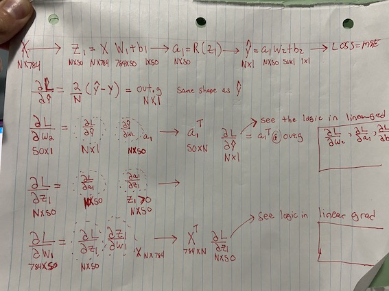

---
jupytext:
  formats: ipynb,md:myst
  text_representation:
    extension: .md
    format_name: myst
    format_version: 0.13
    jupytext_version: 1.14.1
kernelspec:
  display_name: Python 3 (ipykernel)
  language: python
  name: python3
---

# Learning About Back Prop

+++

## Grab some MNIST Data

```{code-cell} ipython3
import os
os.chdir('/workspace')
```

```{code-cell} ipython3
from pathlib import Path
import pickle, gzip, math, os, time, shutil, matplotlib as mpl, matplotlib.pyplot as plt
import torch
from fastcore.test import test_close

MNIST_URL='https://github.com/mnielsen/neural-networks-and-deep-learning/blob/master/data/mnist.pkl.gz?raw=true'
path_data = Path('data')
path_data.mkdir(exist_ok=True)
path_gz = path_data/'mnist.pkl.gz'

from urllib.request import urlretrieve
if not path_gz.exists():
    urlretrieve(MNIST_URL, path_gz)
    
with gzip.open(path_gz, 'rb') as f: 
    ((x_train, y_train), (x_valid, y_valid), _) = pickle.load(f, encoding='latin-1')
    
x_train, y_train, x_valid, y_valid = map(torch.tensor, [x_train, y_train, x_valid, y_valid])
```

```{code-cell} ipython3
x_train.shape
```

## Simple 2 Layer Network

- TODO: draw a sketch here of the network and activations
- hidden layer with 50 neurons
- $x$ -------> $z_1 = xw_1+b_1$ -------> $a_1 = \text{relu}(z_1)$ -------> $\hat{y} = a_1w_2+b_2$ -------> $\text{loss} = \text{MSE}(y-\hat{y})$

**Tensor Shapes**

$nh=50$ is the number of  neurons in the first layer

$N$ is like the batch dimension. 
Broadcasting can take care of $N$. It will be $N=1$ when dealing with the bias terms in code.


$x$ : $(N, 784)$

$w_1$ : $(784, 50)$


$b_1$ : $(N, 50)$

$z_1$ : $(N, 50)$

$a_1$ : $(N, 50)$

$w_2$ : $(50, 1)$

$b_2$ : $(N, 1)$

$\hat{y}$ : $(N, 1)$




```{code-cell} ipython3
x = x_train[:32]; y = y_train[:32][:,None] # to make things faster just take a batch
N, xdim = x.shape
nh = 50 # hidden layer neurons

w1 = torch.rand((xdim, nh))
b1 = torch.zeros(nh)
```

```{code-cell} ipython3
(x @ w1).shape, b1.shape
```

```{code-cell} ipython3
z1 = x @ w1 + b1
z1.shape
```

```{code-cell} ipython3
z1.shape
```

```{code-cell} ipython3
w1.shape
```

```{code-cell} ipython3
x.shape
```

```{code-cell} ipython3
a1 = z1.clamp(min=0.) # relu
a1.shape
```

```{code-cell} ipython3
w2 = torch.rand((nh,1))
b2 = torch.zeros(1)
```

```{code-cell} ipython3
w2.shape, b2.shape
```

```{code-cell} ipython3
out = a1 @ w2 + b2
out.shape
```

```{code-cell} ipython3
out.shape, y.shape
```

Also we want the loss function to be a scalar function so we can compute
its gradient. So we need to reduce the dimension by taking the mean/sum etc.
MSE is not the right loss for this classification problem
but we going to do it to keep things simple!

```{code-cell} ipython3
def loss_func(yp, yh):
    return (yp - yh).square().mean()
```

```{code-cell} ipython3
loss = loss_func(out, y)
loss
```

```{code-cell} ipython3
def lin_layer(x, w, b):
    return x @ w + b

def linear_grad(out, x, w, b): # from the 03_gradients_linear_layer notebook
    x.g = out.g @ w.t()
    w.g = x.t() @ out.g
    b.g = out.g.sum(dim=0)
    
def relu(x):
    return x.clamp(min=0.) # relu

def forward_pass(x):
    z1 = lin_layer(x, w1, b1)
    a1 = relu(z1)
    ypred = lin_layer(a1, w2, b2)
    return ypred
```

```{code-cell} ipython3
torch.equal(forward_pass(x), out)
```

```{code-cell} ipython3
out = forward_pass(x)
```

```{code-cell} ipython3
loss = loss_func(out, y)
```

```{code-cell} ipython3
loss
```

```{code-cell} ipython3
out.g = 2/N*(out-y)
out.g.shape
```

```{code-cell} ipython3
linear_grad(out, a1, w2, b2)
```

```{code-cell} ipython3
print(a1.g.shape, w2.g.shape, b2.g.shape)
```

```{code-cell} ipython3
z1.g = a1.g * (z1>0).float() # using chain rule and gradient of relu
z1.g.shape
```

```{code-cell} ipython3
linear_grad(z1, x, w1, b1)
```

```{code-cell} ipython3
print(x.g.shape, w1.g.shape, b1.g.shape)
```

```{code-cell} ipython3

```

```{code-cell} ipython3
# CHECK with Torch Autograd
x.requires_grad_(True)
w1.requires_grad_(True)
b1.requires_grad_(True)
z1.requires_grad_(True)

a1.requires_grad_(True)
w2.requires_grad_(True)
b2.requires_grad_(True)
out.requires_grad_(True)

out = forward_pass(x)
loss = loss_func(out, y)
loss.backward()
```

```{code-cell} ipython3
test_close(x.g, x.grad)
test_close(w1.g, w1.grad)
test_close(w2.g, w2.grad)
test_close(b1.g, b1.grad)
test_close(b2.g, b2.grad)
```

```{code-cell} ipython3

```

```{code-cell} ipython3

```

```{code-cell} ipython3

```

```{code-cell} ipython3

```

```{code-cell} ipython3

```

```{code-cell} ipython3

```

```{code-cell} ipython3
batch_size = 5000
lr = 3e-2
for epoch in range(10):
    for i in range(0, len(x_train), batch_size):
        xb = x_train[i:i+batch_size]
        ypb = forward_pass(xb)
        lossb = loss_func(ypb, y_train[i:i+batch_size])
        lossb.backward()
        print(lossb)

        with torch.no_grad():
            # not that -= is in place!
            w1 -= lr * w1.grad 
            w2 -= lr * w2.grad
            b1 -= lr * b1.grad
            b2 -= lr * b2.grad
            
            w1.grad.zero_()
            w2.grad.zero_()     
            b1.grad.zero_()
            b2.grad.zero_()
    print(lossb)
```

```{code-cell} ipython3

```
