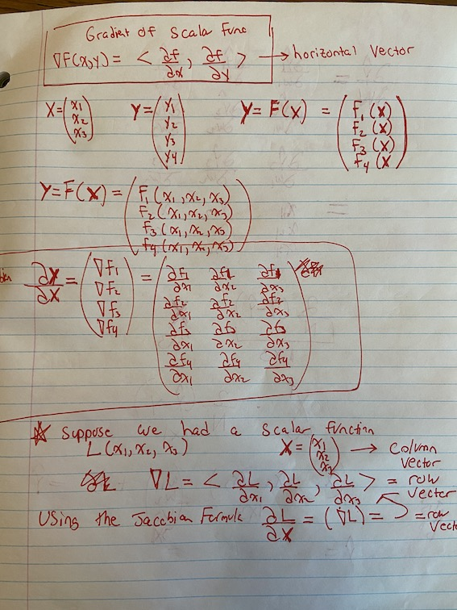
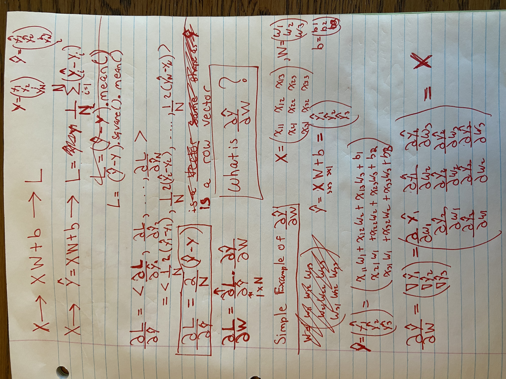
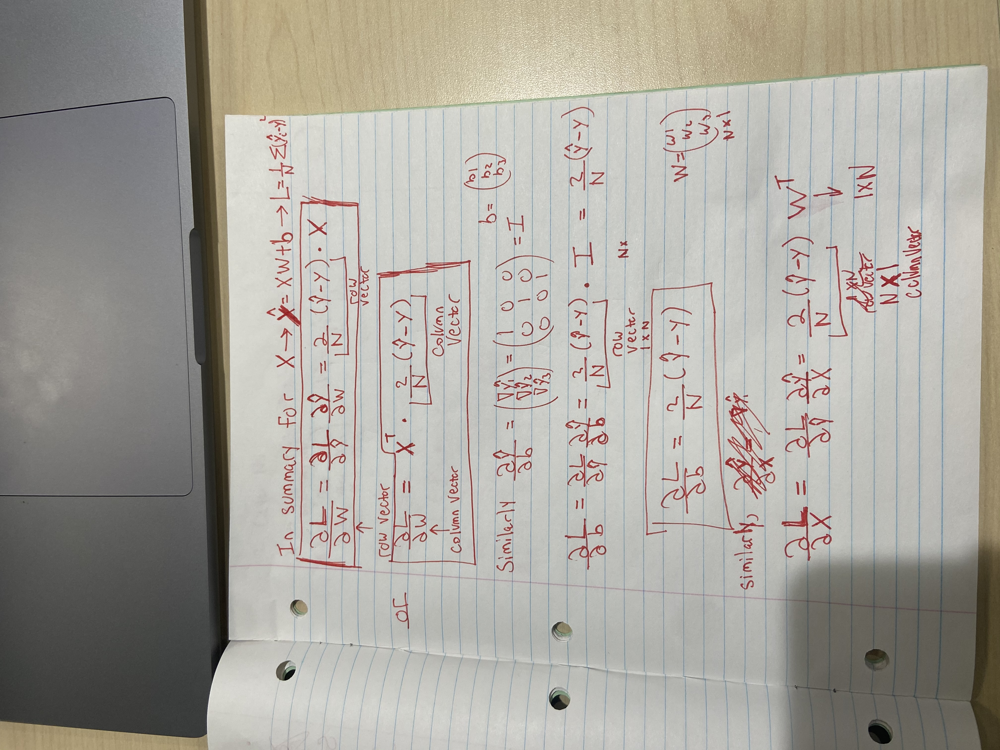
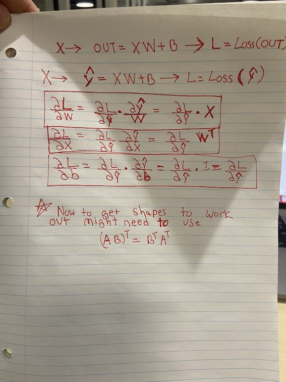
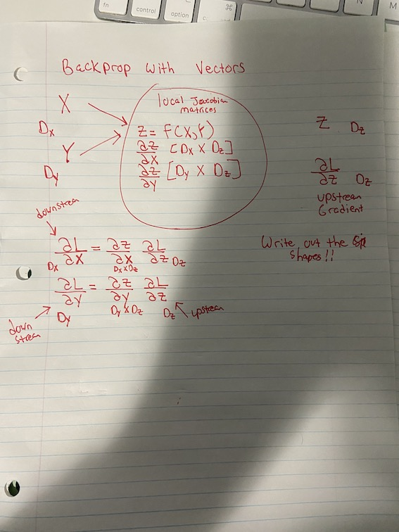
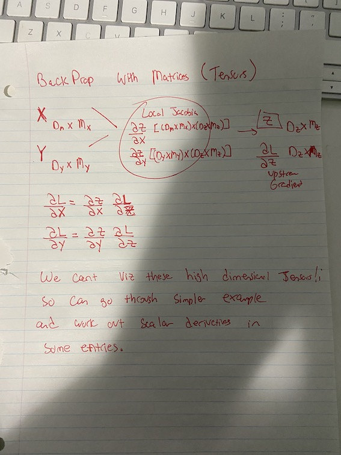
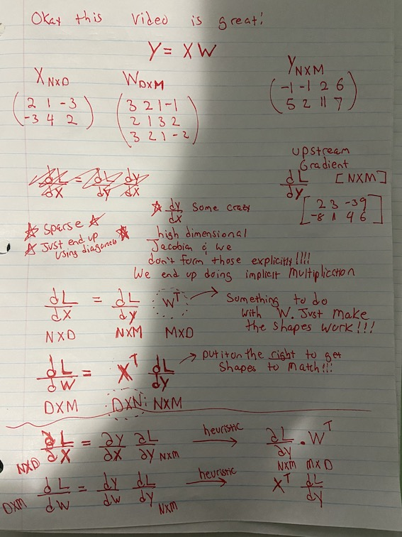

---
jupytext:
  formats: ipynb,md:myst
  text_representation:
    extension: .md
    format_name: myst
    format_version: 0.13
    jupytext_version: 1.14.1
kernelspec:
  display_name: Python 3 (ipykernel)
  language: python
  name: python3
---

# Gradient Practice

+++

## Linear Layer Gradients

```{code-cell} ipython3
import os
os.chdir('/workspace')
import torch
```

This code is to better understand some simple gradient calculations (math and code).
Here are some notes I was taking on paper.

**TODO**: rewrite digitally and make it nice with Sketchbook and Wacom tablet.











+++

Okay I had some misunderstanding above and maybe some mistakes. Then someone in the study group shared this awesome video with me. 

https://www.youtube.com/watch?v=dB-u77Y5a6A&list=PL5-TkQAfAZFbzxjBHtzdVCWE0Zbhomg7r&t=2312s

So it really explains well that these Jacobian Matrices are getting high dimensional etc. BUT, they
are sparse and diagonal and have "special" properties. Most of the local Jacobian matrices end
up being very sparse. This means we don't have to explicitly form the Jacobian and we can instead
do some implicit multiplication. We get some nice tricks to express the explicit Jacobian multiplications as 
some simpler implicit multiplications. 







```{code-cell} ipython3
X = torch.tensor([[1.,2.,3.,],[4.,5.,6.], [7.,8.,9.]]).requires_grad_(True)
N = X.shape[0]
X.shape
```

```{code-cell} ipython3
X
```

```{code-cell} ipython3
Y = torch.tensor([[5.], [25.], [50.]])
Y.shape
```

```{code-cell} ipython3
Y
```

```{code-cell} ipython3
W = torch.tensor([[.1], [.2], [.3]]).requires_grad_(True)
```

```{code-cell} ipython3
W.shape
```

```{code-cell} ipython3
W
```

```{code-cell} ipython3
b = torch.tensor(1.).requires_grad_(True)
b.shape
```

```{code-cell} ipython3
b
```

```{code-cell} ipython3
out = X @ W + b
out
```

```{code-cell} ipython3
L = (out-Y).square().mean()
```

```{code-cell} ipython3
L
```

```{code-cell} ipython3
L.backward()
```

```{code-cell} ipython3
W.grad
```

```{code-cell} ipython3
(2/N * (out-Y)).t() @ X # W.grad has horizontal vector
```

```{code-cell} ipython3
X.t() @ (2/N * (out-Y)) # W.grad has vertical vector
```

```{code-cell} ipython3
b.grad
```

```{code-cell} ipython3
(2/N * (out-Y)).t().sum()
```

```{code-cell} ipython3
(2/N * (out-Y)).sum()  # b.grad as vertical vector
```

```{code-cell} ipython3
X.grad
```

```{code-cell} ipython3
2/N * (out-Y) @ W.t() # X.grad
```

```{code-cell} ipython3
out.g = 2/N * (out-Y)
```

```{code-cell} ipython3
def linear_grad(out, X, W, b):
    # out = XW + b 
    # LOSS = LossFunc(out)
    # LOSS.backward()
    X.g = out.g @ W.t()
    W.g = X.t() @ out.g
    b.g = out.g.sum(dim=0)
```

```{code-cell} ipython3
linear_grad(out, X, W, b)
```

```{code-cell} ipython3
assert torch.equal(X.grad,X.g)
```

```{code-cell} ipython3
assert torch.equal(W.grad,W.g)
```

```{code-cell} ipython3
assert torch.equal(b.grad,b.g)
```

```{code-cell} ipython3
b.grad, b.g
```
