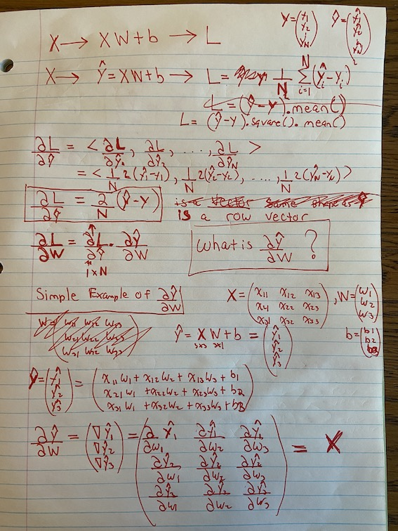
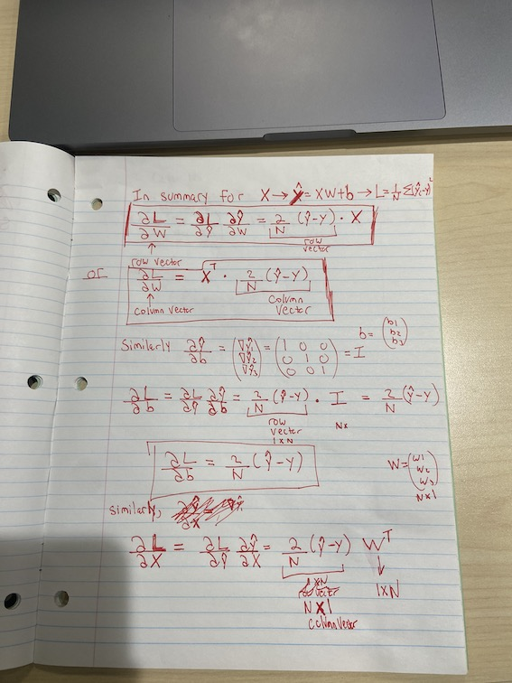

---
jupytext:
  formats: ipynb,md:myst
  text_representation:
    extension: .md
    format_name: myst
    format_version: 0.13
    jupytext_version: 1.14.1
kernelspec:
  display_name: Python 3 (ipykernel)
  language: python
  name: python3
---

# Gradient Practice

+++

## Linear Layer Gradients

```{code-cell} ipython3
import os
os.chdir('/workspace')
import torch
```

This code is to better understand some simple gradient calculations (math and code).
Here are some notes I was taking on paper.

**TODO**: rewrite digitally and make it nice with Sketchbook and Wacom tablet.








```{code-cell} ipython3
X = torch.tensor([[1.,2.,3.,],[4.,5.,6.], [7.,8.,9.]]).requires_grad_(True)
N = X.shape[0]
X.shape
```

```{code-cell} ipython3
X
```

```{code-cell} ipython3
Y = torch.tensor([[5.], [25.], [50.]])
Y.shape
```

```{code-cell} ipython3
Y
```

```{code-cell} ipython3
W = torch.tensor([[.1], [.2], [.3]]).requires_grad_(True)
```

```{code-cell} ipython3
W.shape
```

```{code-cell} ipython3
W
```

```{code-cell} ipython3
b = torch.tensor([[1.],[1.],[1.]]).requires_grad_(True) # probably can just use broadcasting here!
b.shape
```

```{code-cell} ipython3
b
```

```{code-cell} ipython3
yhat = X @ W + b
yhat
```

```{code-cell} ipython3
L = (yhat-Y).square().mean()
```

```{code-cell} ipython3
L
```

```{code-cell} ipython3
L.backward()
```

```{code-cell} ipython3
W.grad
```

```{code-cell} ipython3
(2/N * (yhat-Y)).t() @ X # W.grad has horizontal vector
```

```{code-cell} ipython3
X.t() @ (2/N * (yhat-Y)) # W.grad has vertical vector
```

```{code-cell} ipython3
b.grad
```

```{code-cell} ipython3
(2/N * (yhat-Y)).t() @ torch.eye(3) # b.grad as horizontal vector. don't need the torch.eye() but there for completeness and to show Chain Rule!
```

```{code-cell} ipython3
(2/N * (yhat-Y))  # b.grad as vertical vector
```

```{code-cell} ipython3
X.grad
```

```{code-cell} ipython3
2/N * (yhat-Y) @ W.t() # X.grad
```

```{code-cell} ipython3
yhat.g = 2/N * (yhat-Y)
```

```{code-cell} ipython3

```

```{code-cell} ipython3
def linear_grad(yhat, X, W, b):
    # yhat = XW + b 
    # LOSS = LossFunc(yhat)
    # LOSS.backward()
    X.g = yhat.g @ W.t()
    W.g = X.t() @ yhat.g
    b.g = yhat.g
```

```{code-cell} ipython3
linear_grad(yhat, X, W, b)
```

```{code-cell} ipython3
X.g = yhat.g @ W.t()
W.g = X.t() @ yhat.g
b.g = yhat.g
```

```{code-cell} ipython3
X.grad == X.g
```

```{code-cell} ipython3
W.grad == W.g
```

```{code-cell} ipython3
b.grad == b.g
```
