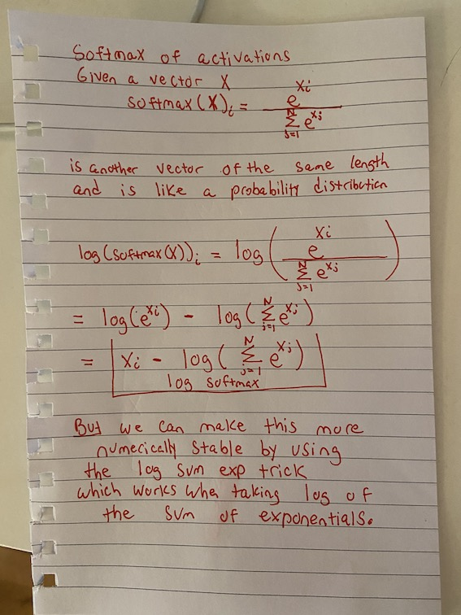
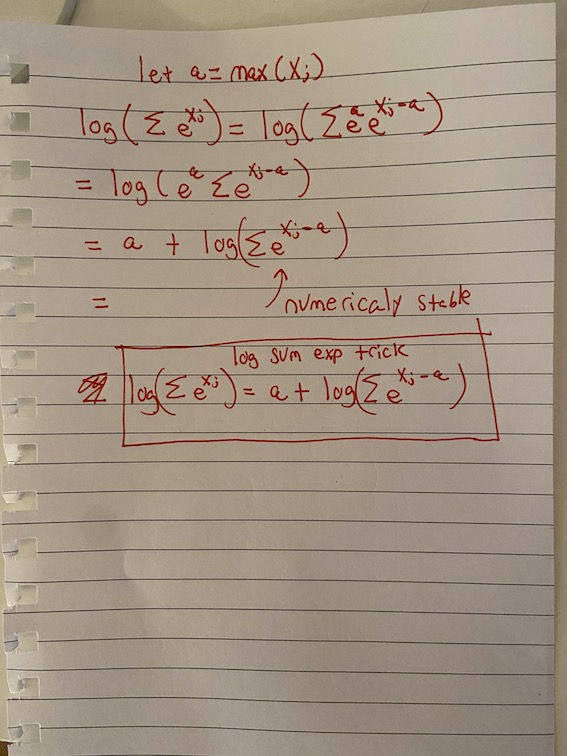

---
jupytext:
  formats: ipynb,md:myst
  text_representation:
    extension: .md
    format_name: myst
    format_version: 0.13
    jupytext_version: 1.14.1
kernelspec:
  display_name: Python 3 (ipykernel)
  language: python
  name: python3
---

```{code-cell} ipython3
import pickle,gzip,math,os,time,shutil,torch,matplotlib as mpl,numpy as np,matplotlib.pyplot as plt
from pathlib import Path
from torch import tensor,nn
import torch.nn.functional as F
from fastcore.test import test_close
import os
os.chdir('/workspace')

torch.set_printoptions(precision=2, linewidth=140, sci_mode=False)
torch.manual_seed(1)
mpl.rcParams['image.cmap'] = 'gray'

MNIST_URL='https://github.com/mnielsen/neural-networks-and-deep-learning/blob/master/data/mnist.pkl.gz?raw=true'
path_data = Path('data')
path_data.mkdir(exist_ok=True)
path_gz = path_data/'mnist.pkl.gz'

from urllib.request import urlretrieve
if not path_gz.exists():
    urlretrieve(MNIST_URL, path_gz)
with gzip.open(path_gz, 'rb') as f: ((x_train, y_train), (x_valid, y_valid), _) = pickle.load(f, encoding='latin-1')
x_train, y_train, x_valid, y_valid = map(tensor, [x_train, y_train, x_valid, y_valid])
```

Some math to go along with this notebook




```{code-cell} ipython3
x_train = x_train[:512]
y_train = y_train[:512]
```

```{code-cell} ipython3
y = y_train
```

```{code-cell} ipython3
n,m = x_train.shape
c = y_train.max()+1
nh = 50
```

```{code-cell} ipython3
class Model(nn.Module):
    def __init__(self, n_in, nh, n_out):
        super().__init__()
        self.layers = [nn.Linear(n_in,nh), nn.ReLU(), nn.Linear(nh,n_out)]
        
    def __call__(self, x):
        for l in self.layers: x = l(x)
        return x
```

```{code-cell} ipython3
model = Model(m, nh, 10) # now the output of the last layer is dimension 10
pred = model(x_train)
pred.shape
```

Everything above was from last time (see notebook 03 back prop).

```{code-cell} ipython3
pred[:10]
```

Lets look at the first prediction and take the `softmax` of it

```{code-cell} ipython3
def softmax(x):
    return torch.exp(x) / torch.exp(x).sum()
```

```{code-cell} ipython3
softmax(pred[0])
```

```{code-cell} ipython3
softmax(pred[0]).sum() #should sum to 1
```

But that above definition will only work for a vector `pred`. What if we wanted to pass the batch `pred`.

```{code-cell} ipython3
torch.exp(pred).shape
```

```{code-cell} ipython3
torch.exp(pred).sum(dim=1).shape
```

We need to make the sizes proper for broadcasting:

```{code-cell} ipython3
torch.exp(pred).sum(dim=1)[:, None].shape
```

```{code-cell} ipython3
torch.exp(pred) / torch.exp(pred).sum(dim=1)[:, None]
```

```{code-cell} ipython3
(torch.exp(pred) / torch.exp(pred).sum(dim=1)[:, None]).sum(dim=1)
```

```{code-cell} ipython3
def softmax(x):
    return torch.exp(x) / torch.exp(x).sum(dim=1)[:, None]
```

```{code-cell} ipython3
softmax(pred)
```

In practice we need the `log` of the [softmax](https://ogunlao.github.io/2020/04/26/you_dont_really_know_softmax.html) because it has improvements (numerical stability etc)

```{code-cell} ipython3
def log_softmax(x):
    return torch.log(torch.exp(x) / torch.exp(x).sum(dim=1)[:, None])
```

```{code-cell} ipython3
log_softmax(pred)
```

Using `log` rules we can rewrite this

```{code-cell} ipython3
def log_softmax(x):
    return x - torch.log(torch.exp(x).sum(dim=1)[:, None])
```

```{code-cell} ipython3
log_softmax(pred)
```

Then, there is a way to compute the log of the sum of exponentials in a more stable way, called the [LogSumExp trick](https://en.wikipedia.org/wiki/LogSumExp). The idea is to use the following formula:

$$\log \left ( \sum_{j=1}^{n} e^{x_{j}} \right ) = \log \left ( e^{a} \sum_{j=1}^{n} e^{x_{j}-a} \right ) = a + \log \left ( \sum_{j=1}^{n} e^{x_{j}-a} \right )$$

where a is the maximum of the $x_{j}$.

```{code-cell} ipython3
def logsumexp(x): # want to work for batch of vectors x
    a = x.max(dim=1)[0][:, None] # max entry for each row of shape [batch_size, 1]
    return a + torch.exp(x-a).sum(dim=1).log()[:,None]
```

```{code-cell} ipython3
logsumexp(pred).shape
```

```{code-cell} ipython3
def log_softmax(x):
     return x - logsumexp(x)
```

```{code-cell} ipython3
log_softmax(pred)
```

```{code-cell} ipython3
sm_pred = log_softmax(pred)
sm_pred
```

The cross entropy loss for some target $x$ and some prediction $p(x)$ is given by:

$$ -\sum x\, \log p(x) $$

But since our $x$s are 1-hot encoded, this can be rewritten as $-\log(p_{i})$ where i is the index of the desired target.

This can be done using numpy-style [integer array indexing](https://docs.scipy.org/doc/numpy-1.13.0/reference/arrays.indexing.html#integer-array-indexing). Note that PyTorch supports all the tricks in the advanced indexing methods discussed in that link.

```{code-cell} ipython3
sm_pred[:5]
```

```{code-cell} ipython3
y[:5]
```

```{code-cell} ipython3
def nll(pred, y):
    return -pred[range(len(pred)), y].mean()
```

```{code-cell} ipython3
test_close(F.log_softmax(pred, dim=1), sm_pred)
```

```{code-cell} ipython3
nll(sm_pred, y)
```

```{code-cell} ipython3
F.cross_entropy(pred, y)
```

```{code-cell} ipython3
F.nll_loss(F.log_softmax(pred, dim=1), y) # same as F.cross_entropy
```

So in Pytorch F.cross_entropy applies the log_softmax and then the nll_loss.
This is different from Tensorflow. See [here](https://stackoverflow.com/questions/72622202/why-is-the-tensorflow-and-pytorch-crossentropy-loss-returns-different-values-for).

+++

# Basic training loop

```{code-cell} ipython3
with gzip.open(path_gz, 'rb') as f: ((x_train, y_train), (x_valid, y_valid), _) = pickle.load(f, encoding='latin-1')
x_train, y_train, x_valid, y_valid = map(tensor, [x_train, y_train, x_valid, y_valid])
```

```{code-cell} ipython3
class Model(nn.Module):
    def __init__(self, n_in, nh, n_out):
        super().__init__()
        self.layers = [nn.Linear(n_in,nh), nn.ReLU(), nn.Linear(nh,n_out)]
        
    def forward(self, x):
        for l in self.layers: x = l(x)
        return x
```

```{code-cell} ipython3
model = Model(784, 50, 10)
```

```{code-cell} ipython3
def accuracy(ypred, ytrue): return (torch.argmax(ypred, dim=1)==ytrue).float().mean()
```

```{code-cell} ipython3
bs = 512
lr = 0.5
for epoch in range(3):
    for i in range(0, len(x_train), bs):
        ypred = model(x_train[i:i+bs]) # have not been put through softmax etc.
        ytrue = y_train[i:i+bs]
        loss = F.cross_entropy(ypred, ytrue)
        loss.backward()
        with torch.no_grad():
            for l in model.layers:
                if hasattr(l, 'weight'):
                    l.weight -= lr*l.weight.grad
                    l.bias -= lr*l.bias.grad
                    l.weight.grad.zero_()
                    l.bias.grad.zero_()
        print(accuracy(ypred, ytrue), loss)
```

```{code-cell} ipython3

```
